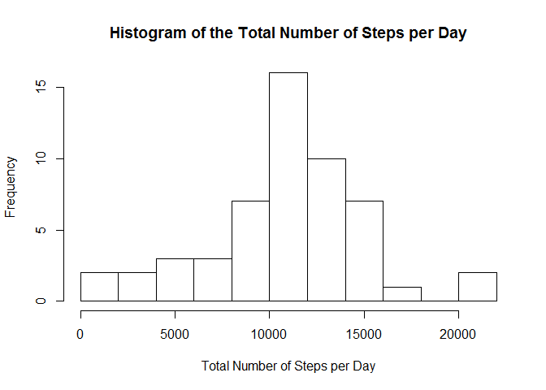
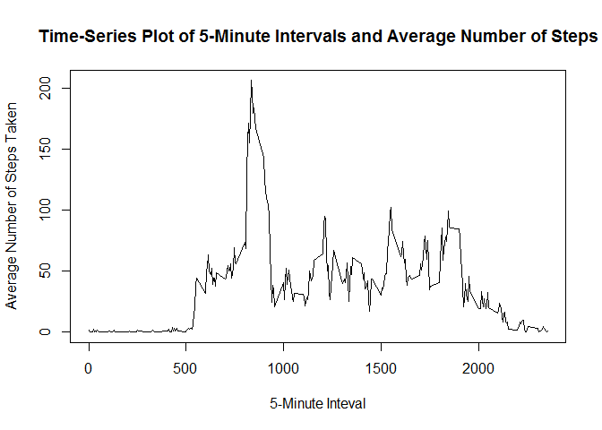
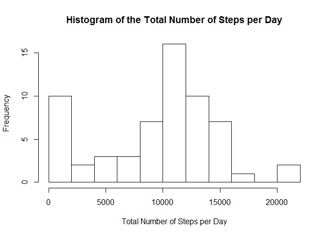
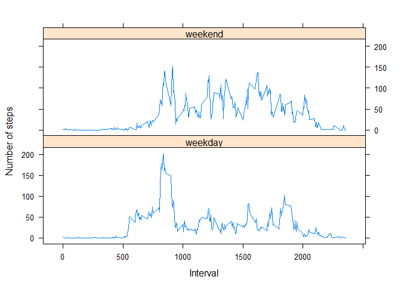

# Reproducible Research: Peer Assignment 1

output:
  html_document: 
    keep_md: true


## Loading and preprocessing the data

Read and preprocess the data.


```r
temp <- tempfile()
download.file("http://d396qusza40orc.cloudfront.net/repdata%2Fdata%2Factivity.zip", temp)
activity <- read.csv(unz(temp, "activity.csv"), header=TRUE, na.strings="NA")
unlink(temp)

activity$date <- as.Date(activity$date)
dim(activity)
```

```
## [1] 17568     3
```

```r
str(activity)
```

```
## 'data.frame':	17568 obs. of  3 variables:
##  $ steps   : int  NA NA NA NA NA NA NA NA NA NA ...
##  $ date    : Date, format: "2012-10-01" "2012-10-01" ...
##  $ interval: int  0 5 10 15 20 25 30 35 40 45 ...
```


## What is mean total number of steps taken per day?

This part of the assignment ignores cases with missing values in the dataset.  Thus, the code below restricts the dataset to observations with non-missing values.


```r
activity2 <- na.omit(activity)
```


### 1. Histogram of the total number of steps taken each day

First, I use melt() and dcast() functions to compute the total number of steps taken each day.


```r
library(reshape2)

activity2_melt <- melt(activity2[,1:2], id=c("date"), measure.vars=c("steps")) # Melt data (using two variables: steps and date)
sumDay <- dcast(activity2_melt, date ~ variable, sum) # Recast the dataset and compute sum of steps by date
```

Then I create the histogram.


```r
hist(sumDay$steps, breaks = 10, 
     xlab="Total Number of Steps per Day", 
     main="Histogram of the Total Number of Steps per Day")
```

 


### 2a. Mean and median total number of steps taken per day


```r
options ( scipen = 999) # Suppress scientific notation
options(digits=2) # Use two decimal places

meanOriginal <- mean(sumDay$steps) # Mean
medianOriginal <- median(sumDay$steps) # Median
```

Mean total number of steps taken per day: 10766.19  
Median total number of steps taken per day: 10765     


## What is the average daily activity pattern?

### 1. Time seres plot of the 5-minute interval and the average number of steps taken, averaged across all days

First, I use the aggregate () fuction to compute average number of steps per 5-minuteinterval.
Then I create the time series plot.


```r
timeSeries <- aggregate(steps ~ interval, activity2, mean )
plot(timeSeries$interval, timeSeries$steps, type="l",
     xlab="5-Minute Inteval", ylab="Average Number of Steps Taken",
     main="Time-Series Plot of 5-Minute Intervals and Average Number of Steps")
```

 

### 2. Finding the 5-minute interval that contains the maximum number of steps


```r
intervalMaxSteps <- timeSeries[(timeSeries$steps==max(timeSeries$steps)), c("interval")]
```

The 5-minute interval containing the maximum number of steps is interval 835. 

## Imputing missing values

### 1. Calculating and reporting the total number of missing values in the dataset


```r
NArows <- sum(!complete.cases(activity))
```

Total number of rows with missing values: 2304


### 2. Strategy for filling in missing values in the dataset

Using  the aggregate() function, I compute the average number of steps by 5-minute interval.  
I call this variable "MeanStepsInterval". These are the values that I will use to fill missing data in.


```r
meanInterval <- aggregate(steps ~ interval, activity, mean)
names(meanInterval)[names(meanInterval)=="steps"] <- "MeanStepsInterval" 
```

### 3. Creating new dataset equal to original dataset but with missing data filled in


I Merge dataset containing average number of steps by 5-minute interval with the original dataset with missing values.


```r
activityImpute <- merge(activity, meanInterval, all.x=TRUE)
```
      
I Replace NAs in variable "steps" with with average values from variable "MeanStepsInterval"; then I drop "MeanStepsInterval" variable. 


```r
activityImpute$steps[is.na(activityImpute$steps)] <- activityImpute$MeanStepsInterval
```

```
## Warning: number of items to replace is not a multiple of replacement
## length
```

```r
activityImpute$MeanStepsInterval <- NULL
```

Verify that the dimension of the new dataset is equal to that of the original dataset: 17,568 cases and 3 variables.
Also, verity that the number of cases with missing values is equal to 0 in the new dataset


```r
dim(activityImpute) # Check that number of cases = 17,568 and number of variables = 3
```

```
## [1] 17568     3
```

```r
sum(!complete.cases(activityImpute)) # Check that there are no missing values
```

```
## [1] 0
```

### 4. Histogram, mean, and median of total number of steps taken per day

I Compute total steps per day and create a histogram.


```r
activityImputeTotal <- aggregate(steps ~ date, activityImpute, sum)
hist(activityImputeTotal$steps, breaks = 10, 
     xlab="Total Number of Steps per Day", 
     main="Histogram of the Total Number of Steps per Day")
```

 

I compute the mean and median total number of steps taken per day.


```r
meanImpute <- mean(activityImputeTotal$steps) # Mean
medianImpute <- median(activityImputeTotal$steps) # Median
```

Mean total number of steps taken per day: 9371.44 
Median total number of steps taken per day: 10395


Conclusion: Yes, the mean and median values obtained after imputing missing values differ from the values in the first part of the assignment. The values computed from the imputed data are lower than those from the original non-imputed data. Therefore, imputing missing data has decreased the estimates of the total daily number of steps. 

## Are there differences in activity patterns between weekdays and weekends?

### 1. Creating factor variable with two levels: "weekday" and "weekend"

I use the weekdays() functions and create a new variable "day", with days recoded as weekday or weekend


```r
activityImpute$day[weekdays(activityImpute$date)=="Monday"] <- "weekday"
activityImpute$day[weekdays(activityImpute$date)=="Tuesday"] <- "weekday"
activityImpute$day[weekdays(activityImpute$date)=="Wednesday"] <- "weekday"
activityImpute$day[weekdays(activityImpute$date)=="Thursday"] <-"weekday"
activityImpute$day[weekdays(activityImpute$date)=="Friday"] <- "weekday"
activityImpute$day[weekdays(activityImpute$date)=="Saturday"] <- "weekend"
activityImpute$day[weekdays(activityImpute$date)=="Sunday"] <- "weekend"

activityImpute$day <- factor(activityImpute$day, levels=c("weekday","weekend"))
```

### 2. Panel plot contining a time series plot of 5-minute intevals and average number of steps

First, I use aggregate() function to compute total steps per weekday/weekend and interval.
Then I use the lattice library to create the panel plot.


```r
timeSeriesDay <- aggregate(steps ~ day + interval, activityImpute, mean ) 
library(lattice)

xyplot(steps ~ interval | day, data = timeSeriesDay, type="l", 
       layout = c(1,2), xlab="Interval", ylab="Number of steps")
```

 
